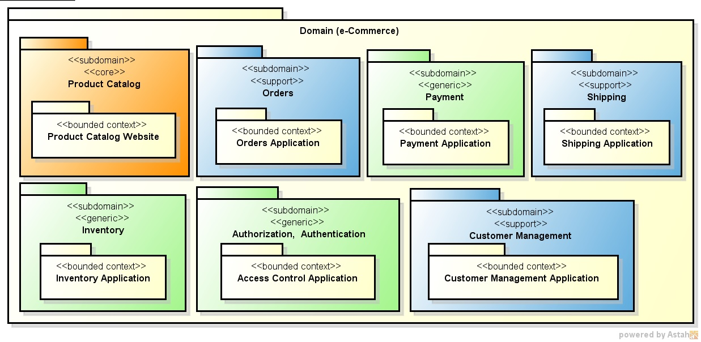

# E-Commerce & Clean Architecture

# Core Domain & Sub-Domain

# Bounded Contexts, Aggregates & Entities

## 1. Product Catalog Subdomain / Product Catalog Website

* **Loại Subdomain:** `Core`
* **Mô tả:** Chịu trách nhiệm quản lý thông tin sản phẩm, danh mục, và hiển thị trên website. Đây là nơi xác định các thuộc tính, biến thể và cấu trúc của sản phẩm.

### Đề xuất Aggregate & Entities:

* **`Product` Aggregate:**
    * **Aggregate Root:** `Product` Entity (ID sản phẩm, Tên, Mô tả, Giá cơ bản).
    * **Entities con:**
        * `ProductVariant` (ID biến thể, Kích thước, Màu sắc, SKU, Giá cụ thể cho biến thể, Số lượng tồn kho - *Lưu ý: số lượng tồn kho có thể thuộc về `Inventory` Context*).
        * `ProductReview` (ID đánh giá, Nội dung, Đánh giá sao, ID người dùng - *Có thể là Entity con hoặc Aggregate riêng tùy độ phức tạp của tính năng đánh giá*).
    * **Value Objects:** `Money`, `ImageURL`, `Dimension`, `Specification`.
    * **Quy tắc bất biến (Invariants):**
        * Giá của một `ProductVariant` không thể thấp hơn giá cơ bản của `Product` (nếu có logic này).
        * Một `Product` phải có ít nhất một `ProductVariant` đang hoạt động (nếu áp dụng).

## 2. Orders Subdomain / Orders Application

* **Loại Subdomain:** `Support`
* **Mô tả:** Quản lý việc tạo, theo dõi và xử lý trạng thái cốt lõi của đơn hàng.

### Đề xuất Aggregate & Entities:

* **`Order` Aggregate:**
    * **Aggregate Root:** `Order` Entity (ID đơn hàng, ID khách hàng, Ngày đặt, Trạng thái, Tổng số tiền).
    * **Entities con:**
        * `OrderItem` (ID mục hàng, ID sản phẩm, Số lượng, Giá tại thời điểm đặt hàng).
    * **Value Objects:** `ShippingAddress`, `BillingAddress`, `PaymentInfoSnapshot` (chỉ là bản sao thông tin thanh toán tại thời điểm đặt hàng, không phải chi tiết thanh toán thực tế).
    * **Quy tắc bất biến (Invariants):**
        * Tổng số tiền của đơn hàng phải luôn bằng tổng số tiền của tất cả các `OrderItem`.
        * Trạng thái của đơn hàng phải tuân theo một chu trình cụ thể và không thể chuyển trạng thái lùi (ví dụ: `Pending` -> `Confirmed` -> `Shipped` -> `Delivered`).

## 3. Payment Subdomain / Payment Application

* **Loại Subdomain:** `Generic`
* **Mô tả:** Xử lý các giao dịch thanh toán thực tế thông qua các cổng thanh toán.

### Đề xuất Aggregate & Entities:

* **`PaymentTransaction` Aggregate:**
    * **Aggregate Root:** `PaymentTransaction` Entity (ID giao dịch, ID đơn hàng/hóa đơn liên quan, Số tiền, Trạng thái giao dịch, Phương thức thanh toán, Thời gian).
    * **Value Objects:** `CreditCardDetails` (đã mã hóa/tokenized), `PaymentMethodInfo` (ví dụ: loại thẻ, tên ngân hàng), `BillingDetails`.
    * **Quy tắc bất biến (Invariants):**
        * Giao dịch chỉ có thể chuyển từ trạng thái `Pending` sang `Completed` hoặc `Failed`.
        * Số tiền giao dịch thực tế phải khớp với số tiền được yêu cầu.

## 4. Shipping Subdomain / Shipping Application

* **Loại Subdomain:** `Support`
* **Mô tả:** Quản lý quy trình vận chuyển và giao nhận hàng hóa.

### Đề xuất Aggregate & Entities:

* **`Shipment` Aggregate:**
    * **Aggregate Root:** `Shipment` Entity (ID vận chuyển, ID đơn hàng liên quan, Mã nhà vận chuyển, Số theo dõi, Trạng thái vận chuyển).
    * **Entities con:**
        * `ShipmentItem` (ID mục vận chuyển, ID sản phẩm, Số lượng sản phẩm trong gói hàng này).
    * **Value Objects:** `DeliveryAddress`, `EstimatedDeliveryDate`, `TrackingHistory`.
    * **Quy tắc bất biến (Invariants):**
        * Các mặt hàng trong `Shipment` phải khớp với các mặt hàng của `Order` mà nó phục vụ.
        * Trạng thái vận chuyển phải tuân theo trình tự logic (ví dụ: `Processing` -> `Picked Up` -> `In Transit` -> `Delivered`).

## 5. Inventory Subdomain / Inventory Application Bounded Context

* **Loại Subdomain:** `Generic`
* **Mô tả:** Quản lý số lượng tồn kho vật lý của các sản phẩm.

### Đề xuất Aggregate & Entities:

* **`InventoryItem` Aggregate:**
    * **Aggregate Root:** `InventoryItem` Entity (ID sản phẩm, Số lượng tồn kho hiện tại, Số lượng tồn kho đã đặt trước).
    * **Value Objects:** `Location` (nếu có nhiều kho hàng), `ReorderLevel` (mức tồn kho để đặt hàng lại).
    * **Invariants:**
        * `Current Stock` (tồn kho hiện tại) không bao giờ được âm.
        * `Reserved Stock` (tồn kho đã đặt trước) không thể lớn hơn `Current Stock`.

## 6. Authorization, Authentication Subdomain / Access Control Application

* **Loại Subdomain:** `Generic`
* **Mô tả:** Cung cấp các dịch vụ xác thực và ủy quyền người dùng.

### Đề xuất Aggregate & Entities:

* **`UserAccount` Aggregate:**
    * **Aggregate Root:** `UserAccount` Entity (ID người dùng, Tên đăng nhập, Mật khẩu đã mã hóa, Email, Trạng thái tài khoản).
    * **Entities con:**
        * `Role` (ID vai trò, Tên vai trò, Quyền hạn - *Nếu `Role` có vòng đời và ID riêng*).
        * `Permission` (ID quyền, Tên quyền - *Nếu `Permission` được quản lý độc lập*).
    * **Value Objects:** `PasswordHash`, `EmailAddress`, `AuthenticationToken`.
    * **Invariants:**
        * Tên đăng nhập hoặc Email phải là duy nhất trong hệ thống.
        * Mật khẩu phải đáp ứng các yêu cầu về độ phức tạp.

## 7. Customer Management Subdomain / Customer Management Application

* **Loại Subdomain:** `Support`
* **Mô tả:** Quản lý thông tin chi tiết cá nhân và lịch sử tương tác của khách hàng.

### Đề xuất Aggregate & Entities:

* **`Customer` Aggregate:**
    * **Aggregate Root:** `Customer` Entity (ID khách hàng, Tên, Thông tin liên hệ chính).
    * **Entities con:**
        * `CustomerPreference` (ID tùy chọn, Loại tùy chọn, Giá trị - ví dụ: tùy chọn nhận email quảng cáo).
        * `LoyaltyPoints` (ID điểm thưởng, Số điểm, Cấp độ - *Nếu quản lý trong Context này*).
    * **Value Objects:** `PhoneNumber`, `EmailAddress`, `BillingAddress`, `ShippingAddress` (nếu địa chỉ không cần ID riêng và chỉ gắn liền với `Customer`).
    * **Invariants:**
        * Email chính của khách hàng phải là duy nhất.
        * Địa chỉ giao hàng mặc định phải là một trong các địa chỉ đã lưu của khách hàng.

graph TD
    subgraph Legend
        direction LR
        S[Supplier] --> C[Customer]
        P[Publisher] --> L[Listener]
        A[Context A] -- Partnership --> B[Context B]
        X[Context X] -- ACL --> Y[Context Y]
        SK[Shared Kernel]
    end

    subgraph E-Commerce Domain
        PC[Product Catalog]
        ORD[Orders]
        PAY[Payment]
        SHIP[Shipping]
        INV[Inventory]
        AUTH[Authorization, Authentication]
        CUST[Customer Management]

        PC -- Open Host Service / Published Language --> ORD
        ORD -- Published Language (OrderConfirmedEvent) --> INV
        ORD -- Published Language (PaymentRequestedEvent) --> PAY
        PAY -- Published Language (PaymentSuccessfulEvent) --> ORD
        PAY -- Published Language (PaymentSuccessfulEvent) --> SHIP
        ORD -- Published Language (OrderReadyForShipmentEvent) --> SHIP

        AUTH -- Shared Kernel / Open Host Service (User ID) --> ORD
        AUTH -- Shared Kernel / Open Host Service (User ID) --> CUST
        AUTH -- Shared Kernel / Open Host Service (User ID) --> PC

        CUST -- Published Language (CustomerUpdatedEvent) --> ORD
        CUST -- Published Language (CustomerUpdatedEvent) --> PAY
        ORD -- Conformist (Customer Info) --> CUST
    end

# Resources
- https://github.com/Sairyss/domain-driven-hexagon
- https://github.com/v-checha/nestjs-template
- https://github.com/zhuravlevma/ddd-nested-aggregates
- https://github.com/zhuravlevma/typescript-ddd-architecture
- https://github.com/SAP/curated-resources-for-domain-driven-design/tree/main/blog
- https://medium.com/building-inventa/how-we-used-event-storming-meetings-for-enabling-software-domain-driven-design-401e5d708eb
- https://medium.com/@lambrych/domain-driven-design-ddd-strategic-design-explained-55e10b7ecc0f
