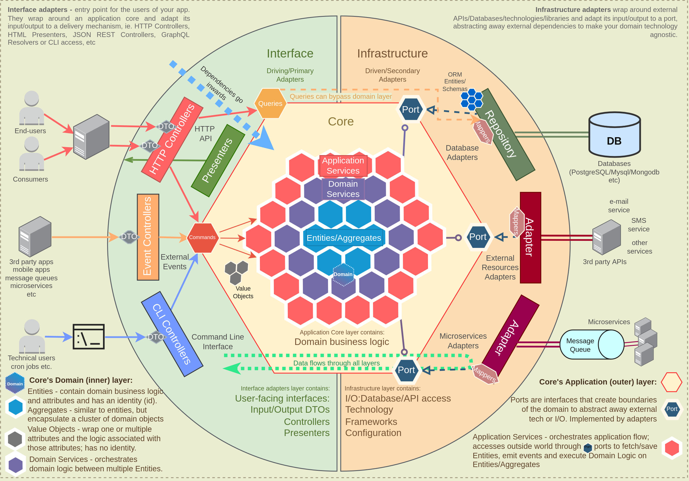

# E-Commerce & Clean Architecture

# Diagram architecture

# Core Domain & Sub-Domain

# Bounded Contexts, Aggregates & Entities

## 1. Product Catalog Subdomain / Product Catalog Website

* **Subdomain Type:** `Core`
* **Description:** Responsible for managing product information, categories, and displaying them on the website. This is where product attributes, variants, and structure are defined.

### Proposed Aggregates & Entities:

* **`Product` Aggregate:**
    * **Aggregate Root:** `Product` Entity (Product ID, Name, Description, Base Price).
    * **Child Entities:**
        * `ProductVariant` (Variant ID, Size, Color, SKU, Specific price for variant, Stock quantity - Note: stock quantity can belong to the `Inventory` Context).
        * `ProductReview` (Review ID, Content, Star rating, User ID - Can be a child Entity or a separate Aggregate depending on the complexity of the review feature)..
    * **Value Objects:** `Money`, `ImageURL`, `Dimension`, `Specification`.
    * **Invariants:**
        * The price of a `ProductVariant` cannot be lower than the base price of the `Product` (if this logic applies).
        * A `Product` must have at least one active ProductVariant (if applicable).

## 2. Orders Subdomain / Orders Application

* **Subdomain Type:** `Support`
* **Description:** Manages the creation, tracking, and core status processing of orders.

### Proposed Aggregates & Entities:

* **`Order` Aggregate:**
    * **Aggregate Root:** `Order` Entity (Order ID, Customer ID, Order Date, Status, Total Amount).
    * **Child Entities:**
        * `OrderItem` (Item ID, Product ID, Quantity, Price at the time of order).
    * **Value Objects:** `ShippingAddress`, `BillingAddress`, `PaymentInfoSnapshot` (only a copy of payment information at the time of order, not actual payment details).
    * **Invariants:**
        * The total amount of the order must always equal the sum of all `OrderItem` amounts.
        * The order status must follow a specific lifecycle and cannot transition backward (e.g., `Pending` -> `Confirmed` -> `Shipped` -> `Delivered`).

## 3. Payment Subdomain / Payment Application

* **Subdomain Type:** `Generic`
* **Description:** Handles actual payment transactions through payment gateways.

### Proposed Aggregates & Entities:

* **`PaymentTransaction` Aggregate:**
    * **Aggregate Root:** `PaymentTransaction` Entity (Transaction ID, Related Order/Invoice ID, Amount, Transaction Status, Payment Method, Timestamp).
    * **Value Objects:** `CreditCardDetails` encrypted/tokenized), `PaymentMethodInfo` (e.g., card type, bank name), `BillingDetails`.
    * **Invariants:**
        * A transaction can only transition from `Pending` to `Completed` or `Failed`..
        * The actual transaction amount must match the requested amount.

## 4. Shipping Subdomain / Shipping Application

* **Subdomain Type:** `Support`
* **Description:** Manages the shipping and delivery process for goods.

### Proposed Aggregates & Entities:

* **`Shipment` Aggregate:**
    * **Aggregate Root:** `Shipment` Entity (Shipment ID, Related Order ID, Carrier Code, Tracking Number, Shipment Status).
    * **Entities con:**
        * `ShipmentItem` (Shipment Item ID, Product ID, Quantity of product in this package).
    * **Value Objects:** `DeliveryAddress`, `EstimatedDeliveryDate`, `TrackingHistory`.
    * **Invariants:**
        * Items in a `Shipment` must match the items of the Order it serves.
        * Shipping status must follow a logical sequence (e.g., `Processing` -> `Picked Up` -> `In Transit` -> `Delivered`).

## 5. Inventory Subdomain / Inventory Application Bounded Context

* **Subdomain Type:** `Generic`
* **Description:** Manages the physical stock quantity of products.

### Proposed Aggregates & Entities:

* **`InventoryItem` Aggregate:**
    * **Aggregate Root:** `InventoryItem` Entity (Product ID, Current Stock quantity, Reserved Stock quantity).
    * **Value Objects:** `Location` (if multiple warehouses), `ReorderLevel` (stock level for reordering).
    * **Invariants:**
        * `Current Stock` should never be negative.
        * `Reserved Stock` cannot be greater than `Current Stock`.

## 6. Authorization, Authentication Subdomain / Access Control Application

* **Subdomain Type** `Generic`
* **Description:** Provides user authentication and authorization services.

### Proposed Aggregates & Entities:

* **`UserAccount` Aggregate:**
    * **Aggregate Root:** `UserAccount` Entity (User ID, Username, Hashed Password, Email, Account Status).
    * **Entities con:**
        * `Role` (Role ID, Role Name, Permissions - *If `Role` has its own lifecycle and ID*).
        * `Permission`  (Permission ID, Permission Name - *If `Permission` is managed independently*).
    * **Value Objects:** `PasswordHash`, `EmailAddress`, `AuthenticationToken`.
    * **Invariants:**
        * Username or Email must be unique in the system.
        * Password must meet complexity requirements.

## 7. Customer Management Subdomain / Customer Management Application

* **Subdomain Type:** `Support`
* **Description:** Manages customer personal details and interaction history.

### Proposed Aggregates & Entities:

* **`Customer` Aggregate:**
    * **Aggregate Root:** `Customer` Entity (Customer ID, Name, Primary Contact Information).
    * **Entities con:**
        * `CustomerPreference` (Preference ID, Preference Type, Value - e.g., email marketing preference).
    * **Value Objects:** `PhoneNumber`, `EmailAddress`, `BillingAddress`, `ShippingAddress` (if addresses do not require separate IDs and are only tied to `Customer`).
    * **Invariants:**
        * The customer's primary email must be unique.
        * The default shipping address must be one of the customer's saved addresses.